## 📝 **Atualização final do README**

# Kafka n APIs

[](https://www.python.org/)
[](https://kafka.apache.org/)

**Streaming Pi-hole DNS events, Public API data, and Localhost Random Data through Kafka**

`Kafka n APIs` ingests data from **five independent sources** into Apache Kafka topics, where **three independent consumers** process, correlate, and act on these event streams.

---

## Table of Contents

- [Overview](#overview)
- [Architecture](#architecture)
- [Features](#features)
- [Tech Stack](#tech-stack)
- [Getting Started](#getting-started)
- [Project Structure](#project-structure)
- [Configuration](#configuration)
- [Usage](#usage)
- [Roadmap](#roadmap)

---

## Overview

`Kafka n APIs` treats everything as an event stream. Data flows from **five independent sources** into Kafka topics:

| Source | Description |
|--------|-------------|
| **Pi-hole (local)** | Tails `/var/log/pihole/pihole.log` |
| **Pi-hole (API logs)** | Polls `/api/logs/dnsmasq` |
| **Pi-hole (API)** | Fetches `/devices`, `/top_clients`, `/upstreams`, `/ftl`, `/system`, `/queries` |
| **Public APIs** | External data from multiple free test APIs |
| **Localhost Random API** | Synthetic data (people, companies, random text) via `Faker` + Flask |

From there, **three independent consumers** subscribe to these topics and process the data:

1. **Consumer 1** – processes DNS logs (local + API)
2. **Consumer 2** – processes metrics and system data
3. **Consumer 3** – processes external and synthetic data

---

## Architecture

```
┌──────────────────────────┐     ┌────────────────────────────────────────┐
│    Pi-hole (local)       │────▶│                                        │
│  /var/log/pihole.log     │     │                                        │
└──────────────────────────┘     │                                        │
                                 │              Apache Kafka              │
┌──────────────────────────┐     │                                        │
│    Pi-hole (API logs)    │────▶│                                        │
│  /api/logs/dnsmasq       │     │                                        │
└──────────────────────────┘     │                                        │
                                 │                                        │
┌──────────────────────────┐     │                                        │
│    Pi-hole (API)         │────▶│                                        │
│  /devices                │     │                                        │
│  /top_clients            │     │                                        │
│  /upstreams              │     │                                        │
│  /ftl                    │     │                                        │
│  /system                 │     │                                        │
│  /queries                │     │                                        │
└──────────────────────────┘     │                                        │
                                 │                                        │
┌──────────────────────────┐     │                                        │
│    Public APIs           │────▶│                                        │
│  (multiple)              │     │                                        │
└──────────────────────────┘     │                                        │
                                 │                                        │
┌──────────────────────────┐     │                                        │
│    Localhost Random API  │────▶│                                       │
└──────────────────────────┘     │                                        │
                                 │                                        │
                                 └───────┬──────────────┬──────────────┬──┘
                                         │              │              │
                                 ┌───────▼───┐  ┌───────▼───┐  ┌───────▼───┐
                                 │ Consumer  │  │ Consumer  │  │ Consumer  │
                                 │  Service  │  │  Service  │  │  Service  │
                                 └───────────┘  └───────────┘  └───────────┘
```

---

## Features

- ✅ Pi-hole DNS logs via **local file** (real-time)
- ✅ Pi-hole DNS logs via **API** (remote access)
- ✅ Pi-hole metrics: devices, top clients, upstreams, FTL, system, queries
- ✅ Multiple public APIs fetched as Kafka events
- ✅ Localhost random data generator for testing
- ✅ **Three independent consumers** for parallel processing
- ✅ Configurable topics, consumer groups, and partitioning
- ✅ Designed for local development with Docker Compose

---

## Tech Stack

| Layer          | Technology                          |
|----------------|-------------------------------------|
| **Messaging**  | Apache Kafka                        |
| **Producers**  | Python + `kafka-python`             |
| **Consumers**  | Python microservices                |
| **HTTP**       | `requests`                          |
| **APIs**       | Pi-hole, ip-api.com, viacep.com.br, Localhost Random API |
| **Data**       | `pandas`                            |
| **Database**   | PostgreSQL + `psycopg2-binary`      |
| **Config**     | `python-dotenv`                     |
| **Containers** | Docker + Docker Compose             |
| **Dev tools**  | `venv`, `Flask` (for localhost API) |

---

## Getting Started

### Prerequisites

- Python 3.10+
- Docker & Docker Compose
- Pi-hole instance accessible on your network

### 1. Clone the repository

```bash
git clone https://github.com/SEU_USUARIO/kafka-n-apis.git
cd kafka-n-apis
```

### 2. Start Kafka and Zookeeper

```bash
docker compose up -d
```

> Uses `bitnami/kafka` and `bitnami/zookeeper`. Brokers available at `localhost:9092`.

### 3. Install Python dependencies

```bash
pip install -r requirements.txt
```

### 4. Configure environment

```bash
cp .env.example .env
```

Edit `.env` with your Pi-hole URL, API tokens, and Kafka bootstrap.

### 5. Run the localhost random API (separate terminal)

```bash
python -m producer.random_api_server
```

> Runs a Flask server at `http://localhost:5000/random`

### 6. Run the consumers (three separate terminals)

**Consumer 1 (DNS logs):**
```bash
python -m consumers.consumer_1_logs
```

**Consumer 2 (Metrics and system data):**
```bash
python -m consumers.consumer_2_metrics
```

**Consumer 3 (External and synthetic data):**
```bash
python -m consumers.consumer_3_external
```

---

## 📁 **Project Structure (caprichada)**

```mermaid
graph TD
    subgraph "Raiz do Projeto"
        A[docker-compose.yml]
        B[.env.example]
        C[requirements.txt]
        D[README.md]
        E[Makefile]
        F[.gitignore]
    end

    subgraph "src/"
        G[producers/]
        H[consumers/]
        I[services/]
        J[models/]
        K[config/]
        L[utils/]
        M[__main__.py]
    end

    subgraph "producers/"
        N[base_producer.py]
        O[pi_hole_file_monitor.py]
        P[pi_hole_api_logs_poller.py]
        Q[pi_hole_data_poller.py]
        R[public_api_fetcher.py]
        S[random_api_fetcher.py]
    end

    subgraph "consumers/"
        T[base_consumer.py]
        U[consumer_1_logs.py]
        V[consumer_2_metrics.py]
        W[consumer_3_external.py]
    end

    subgraph "services/"
        X[api_client.py]
        Y[random_api_server.py]
        Z[kafka_client.py]
    end

    subgraph "models/"
        AA[pi_hole_log.py]
        AB[pi_hole_metric.py]
        AC[public_api_data.py]
        AD[random_data.py]
    end

    subgraph "config/"
        AE[settings.py]
        AF[topics.py]
    end

    subgraph "utils/"
        AG[logger.py]
        AH[file_watcher.py]
        AI[timestamp.py]
    end

    subgraph "tests/"
        AJ[test_producers.py]
        AK[test_consumers.py]
        AL[conftest.py]
    end

    subgraph "scripts/"
        AM[create_topics.sh]
        AN[delete_topics.sh]
        AO[start_producers.sh]
    end

    %% Conexões
    A --> G
    B --> G
    C --> G
    D --> G
    E --> G
    F --> G

    G --> H
    G --> I
    G --> J
    G --> K
    G --> L
    G --> M

    H --> N
    H --> O
    H --> P
    H --> Q
    H --> R
    H --> S

    I --> T
    I --> U
    I --> V
    I --> W

    J --> X
    J --> Y
    J --> Z

    K --> AA
    K --> AB
    K --> AC
    K --> AD

    L --> AE
    L --> AF

    M --> AG
    M --> AH
    M --> AI

    N --> AJ
    N --> AK
    N --> AL

    O --> AM
    O --> AN
    O --> AO
```




```
kafka-n-apis/
├── docker-compose.yml                    # Kafka + Zookeeper
├── .env.example                          # Environment template
├── requirements.txt                      # Dependências Python
├── README.md                             # Documentação do projeto
├── .gitignore                            # Arquivos ignorados pelo Git
├── Makefile                              # Comandos úteis (opcional)
│
├── src/                                  # Código-fonte principal
│   ├── __init__.py
│   │
│   ├── producers/                        # Produtores (enviam dados para Kafka)
│   │   ├── __init__.py
│   │   ├── base_producer.py              # Classe base para produtores
│   │   ├── pi_hole_file_monitor.py       # Tailing pihole.log → Kafka
│   │   ├── pi_hole_api_logs_poller.py    # Fetching /api/logs/dnsmasq → Kafka
│   │   ├── pi_hole_data_poller.py        # Fetching /devices, /top_clients, /upstreams, etc.
│   │   ├── public_api_fetcher.py         # Public APIs → Kafka
│   │   └── random_api_fetcher.py         # Localhost random API → Kafka
│   │
│   ├── consumers/                        # Consumidores (processam dados do Kafka)
│   │   ├── __init__.py
│   │   ├── base_consumer.py              # Classe base para consumidores
│   │   ├── consumer_1_logs.py            # Processa logs DNS (file + API)
│   │   ├── consumer_2_metrics.py         # Processa métricas (devices, clients, upstreams, etc.)
│   │   └── consumer_3_external.py        # Processa dados externos (public APIs + random)
│   │
│   ├── services/                         # Serviços auxiliares
│   │   ├── __init__.py
│   │   ├── api_client.py                 # Cliente HTTP para APIs externas
│   │   ├── random_api_server.py          # Flask server para dados aleatórios
│   │   └── kafka_client.py               # Cliente Kafka (produtor/consumidor)
│   │
│   ├── models/                           # Modelos de dados (schemas)
│   │   ├── __init__.py
│   │   ├── pi_hole_log.py                # Schema para logs do Pi-hole
│   │   ├── pi_hole_metric.py             # Schema para métricas do Pi-hole
│   │   ├── public_api_data.py            # Schema para dados de APIs públicas
│   │   └── random_data.py                # Schema para dados aleatórios
│   │
│   ├── config/                           # Configurações
│   │   ├── __init__.py
│   │   ├── settings.py                   # Carrega variáveis do .env
│   │   └── topics.py                     # Definição dos tópicos Kafka
│   │
│   ├── utils/                            # Utilitários
│   │   ├── __init__.py
│   │   ├── logger.py                     # Configuração de logs
│   │   ├── file_watcher.py               # Monitoramento de arquivos (tail -f)
│   │   └── timestamp.py                  # Manipulação de timestamps
│   │
│   └── __main__.py                       # Ponto de entrada (opcional)
│
├── tests/                                # Testes
│   ├── __init__.py
│   ├── test_producers.py                 # Testes dos produtores
│   ├── test_consumers.py                 # Testes dos consumidores
│   └── conftest.py                       # Configurações dos testes
│
├── scripts/                              # Scripts de suporte
│   ├── create_topics.sh                  # Cria os tópicos no Kafka
│   ├── delete_topics.sh                  # Remove os tópicos
│   └── start_producers.sh                # Inicia todos os produtores
│
└── data/                                 # Dados locais (opcional)
    └── logs/                             # Logs gerados pelo projeto
```

---

## 📄 **Detalhamento dos arquivos principais**

### **Produtores (src/producers/)**

| Arquivo | Descrição |
|---------|-----------|
| `base_producer.py` | Classe abstrata com métodos comuns (conexão Kafka, envio de mensagens, tratamento de erros) |
| `pi_hole_file_monitor.py` | Monitora `/var/log/pihole/pihole.log` usando `file_watcher.py` e envia linhas para o tópico `pi-hole.logs.file` |
| `pi_hole_api_logs_poller.py` | Faz polling do endpoint `/api/logs/dnsmasq` a cada N segundos e envia para `pi-hole.logs.api` |
| `pi_hole_data_poller.py` | Consulta endpoints `/devices`, `/top_clients`, `/upstreams`, `/ftl`, `/system`, `/queries` e envia para `pi-hole.data.endpoints` |
| `public_api_fetcher.py` | Faz requisições a APIs públicas (ip-api, viacep, etc.) e envia para `public.api.data` |
| `random_api_fetcher.py` | Consulta `http://localhost:5000/random` e envia para `random.data.raw` |

### **Consumidores (src/consumers/)**

| Arquivo | Descrição |
|---------|-----------|
| `base_consumer.py` | Classe abstrata com métodos comuns (conexão Kafka, consumo de mensagens, processamento) |
| `consumer_1_logs.py` | Inscreve-se nos tópicos `pi-hole.logs.file` e `pi-hole.logs.api` e processa logs DNS |
| `consumer_2_metrics.py` | Inscreve-se no tópico `pi-hole.data.endpoints` e processa métricas (dispositivos, top clientes, upstreams, FTL, sistema, queries) |
| `consumer_3_external.py` | Inscreve-se nos tópicos `public.api.data` e `random.data.raw` e processa dados externos |

### **Serviços (src/services/)**

| Arquivo | Descrição |
|---------|-----------|
| `api_client.py` | Cliente HTTP reutilizável para chamar APIs externas (tratamento de erros, retry, timeouts) |
| `random_api_server.py` | Servidor Flask que gera dados aleatórios em `/random` |
| `kafka_client.py` | Encapsula a conexão com Kafka (produção e consumo) |

### **Modelos (src/models/)**

| Arquivo | Descrição |
|---------|-----------|
| `pi_hole_log.py` | Schema para logs do Pi-hole (timestamp, cliente, domínio, status) |
| `pi_hole_metric.py` | Schema para métricas (dispositivos, top clientes, upstreams, etc.) |
| `public_api_data.py` | Schema para dados de APIs públicas (geolocalização, etc.) |
| `random_data.py` | Schema para dados aleatórios (id, valor, categoria, timestamp) |

### **Configuração (src/config/)**

| Arquivo | Descrição |
|---------|-----------|
| `settings.py` | Carrega variáveis do `.env` usando `python-dotenv` |
| `topics.py` | Define constantes com os nomes dos tópicos |

### **Utilitários (src/utils/)**

| Arquivo | Descrição |
|---------|-----------|
| `logger.py` | Configura logging com níveis, cores e formato |
| `file_watcher.py` | Monitora arquivos em tempo real (tail -f) |
| `timestamp.py` | Funções para manipulação de timestamps (formatação, conversão) |

### **Scripts (scripts/)**

| Arquivo | Descrição |
|---------|-----------|
| `create_topics.sh` | Cria os tópicos no Kafka: `pi-hole.logs.file`, `pi-hole.logs.api`, `pi-hole.data.endpoints`, `public.api.data`, `random.data.raw` |
| `delete_topics.sh` | Remove os tópicos (útil para limpeza) |
| `start_producers.sh` | Inicia todos os produtores em background |

---

## Configuration

| Variable              | Description                     | Default           |
|-----------------------|---------------------------------|-------------------|
| `KAFKA_BOOTSTRAP`     | Kafka bootstrap server          | `localhost:9092`  |
| `PIHOLE_URL`          | Pi-hole admin API URL           | —                 |
| `PIHOLE_API_TOKEN`    | Pi-hole API token               | —                 |
| `PIHOLE_LOG_PATH`     | Path to local pihole.log        | `/var/log/pihole/pihole.log` |
| `RANDOM_API_URL`      | Localhost random API URL        | `http://localhost:5000/random` |

---

## Usage

**Consumer 1 (DNS logs):**
```bash
python -m consumers.consumer_1_logs
```

**Consumer 2 (Metrics and system data):**
```bash
python -m consumers.consumer_2_metrics
```

**Consumer 3 (External and synthetic data):**
```bash
python -m consumers.consumer_3_external
```

---

## Roadmap

- [ ] WebSocket API for real-time dashboards
- [ ] Dead-letter queue for failed events
- [ ] Schema Registry and Avro support
- [ ] Metrics export (Prometheus)
- [ ] Kubernetes manifests
