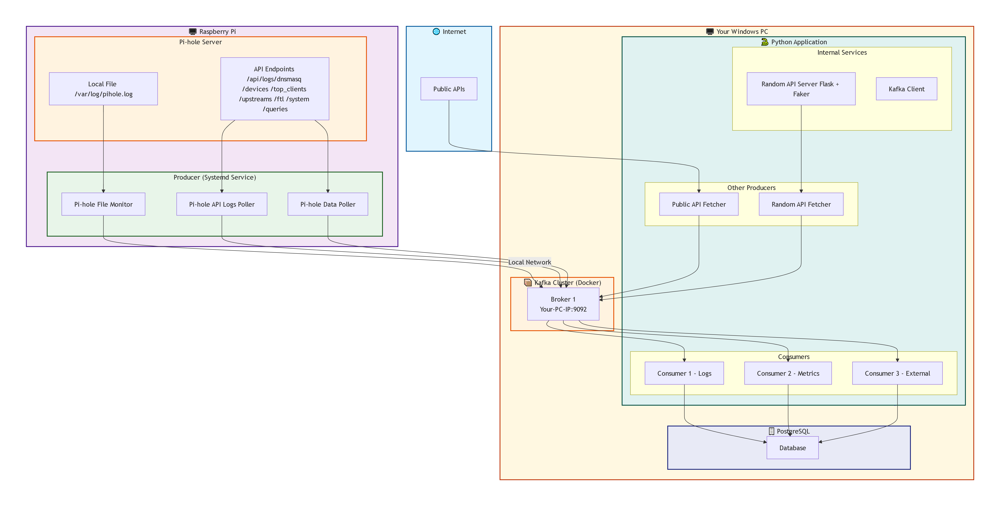

# Kafka n APIs

[](https://www.python.org/)
[](https://kafka.apache.org/)

**Streaming Pi-hole DNS events, Public API data, and Localhost Random Data through Kafka**

`Kafka n APIs` ingests data from **five independent sources** into Apache Kafka topics, where **five independent consumers** process, correlate, and act on these event streams.

---

## Table of Contents

- [Overview](#overview)
- [Architecture](#architecture)
- [Project Structure](#project-structure)
- [Features](#features)
- [Tech Stack](#tech-stack)
- [Getting Started](#getting-started)
- [Configuration](#configuration)
- [Usage](#usage)
- [Roadmap](#roadmap)

---

## Overview

> "Kafka n APIs is a data pipeline that integrates multiple data sources into a single Kafka bus, allowing independent consumers to process information in real-time."

| Source | Description |
|--------|-------------|
| **Pi-hole (local)** | Tails `/var/log/pihole/pihole.log` from a **systemd service on a Raspberry Pi** |
| **Pi-hole (API logs)** | Polls `/api/logs/dnsmasq`, `/logs/ftl`, `/logs/webserver` |
| **Pi-hole (API)** | Fetches `/devices`, `/top_clients`, `/upstreams`, `/ftl`, `/system`, `/queries` |
| **Public APIs** | External data from multiple free test APIs. See the [APIS_REFERENCE.md](APIS_REFERENCE.md) file for the full list. |
| **Faker Data Generator** | Synthetic data (people, companies, random text) generated directly with `Faker` library |

From there, **five independent consumers** subscribe to these topics and process the data:

1. **Consumer 1** – processes DNS logs (local file)
2. **Consumer 2** – processes API logs (dnsmasq, ftl, webserver)
3. **Consumer 3** – processes metrics and system data
4. **Consumer 4** – processes external data (public APIs)
5. **Consumer 5** – processes synthetic data (Faker)

---

## Architecture



## 🎨 **Legend**

| Color | Component | Description |
|-------|-----------|-------------|
| 🔵 Light Blue | 🌐 Internet | External public APIs |
| 🟣 Light Purple | 🖥️ Raspberry Pi | Raspberry Pi running the producer service |
| 🟡 Light Orange | Pi-hole Server | Pi-hole server with local logs and API |
| 🟢 Light Green | Producer Service | Systemd service running the Pi-hole log producer |
| 🟡 Light Yellow | 🖥️ Your Windows PC | Your local computer |
| 🟢 Teal | 🐍 Python Application | Python code with consumers, producers, services and `Faker` data generation |
| 🟠 Orange | 📦 Kafka Cluster (KRaft) | Kafka cluster running in Docker (no Zookeeper) |
| 🔵 Dark Blue | 🗄️ PostgreSQL | Database for persistence |
| 🟢 Light Green | 🖥️ Kafka UI | Kafka UI for visual monitoring and management |

---

### 🗂️ Directory Tree

```
kafkanapis/
├── .env
├── akhq-config.yml
├── APIS_REFERENCE.md
├── comandos-rapidos.txt
├── config.py
├── docker-compose.yml
├── faker_packages.json
├── mermaid-diagrams/
│   ├── architecture-code.mmd
│   ├── architecture.png
│   ├── project-structure.mmd
│   ├── project_structure.png
│   └── workflow.png
├── raspberry-files/
│   ├── .env
│   ├── config.py
│   ├── producer.py
│   └── requirements.txt
├── README.md
├── requirements.txt
├── scripts/
│   ├── __init__.py
│   └── insert_public_apis.py
├── src/
│   ├── __init__.py
│   ├── consumers/
│   │   ├── __init__.py
│   │   ├── consumer_1_logs.py
│   │   ├── consumer_2_api_logs.py
│   │   ├── consumer_3_api_ideas.py
│   │   ├── consumer_4_public_apis.py
│   │   ├── consumer_5_faker.py
│   │   └── test_consumer.py
│   └── producers/
│       ├── __init__.py
│       ├── producer_2_api_logs.py
│       ├── producer_3_api_ideas.py
│       ├── producer_4_public_apis.py
│       └── producer_5_faker.py
├── tests/
│   ├── __init__.py
│   ├── test.py
│   ├── test_pihole_ideas_api.py
│   ├── test_pihole_log_api.py
│   ├── test_pihole_log_reader.py
│   └── tkinter-test.py
```

### 🗂️ Raspberry Pi Directory (Representation)

> ⚠️ **Note:** This directory in the repository is a **representation** of how the files should be organized on the Raspberry Pi. It is **not meant to be copied directly** to the Raspberry Pi — it serves as a reference for the expected structure.

```
raspberry-files/
├── .env
├── config.py
├── producer.py
└── requirements.txt
```

**On the actual Raspberry Pi, the files should be located at:**

```
/home/pi/kafka-pihole-producer/
├── .env
├── config.py
├── producer.py
├── venv/
└── /etc/systemd/system/kafka-pihole-producer.service
```


### 📄 **Main Files Breakdown**

#### **Producers (src/producers/ - Windows)**

| File | Description |
|------|-------------|
| `base_producer.py` | Abstract class with common methods (Kafka connection, message sending, error handling) |
| `pi_hole_api_logs_poller.py` | Polls the `/api/logs/dnsmasq` endpoint every N seconds and sends to `pi-hole.logs.api` |
| `pi_hole_data_poller.py` | Queries endpoints `/devices`, `/top_clients`, `/upstreams`, `/ftl`, `/system`, `/queries` and sends to `pi-hole.data.endpoints` |
| `public_api_fetcher.py` | Makes requests to public APIs (ip-api, viacep, etc.) and sends to `public.api.data` |
| `faker_producer.py` | Generates synthetic data using the `Faker` library and sends to `fake-data.*` topics |

#### **Consumers (src/consumers/ - Windows)**

| File | Description |
|------|-------------|
| `base_consumer.py` | Abstract class with common methods (Kafka connection, message consumption, processing) |
| `consumer_1_logs.py` | Subscribes to topic `pi-hole.logs.file` and processes DNS logs (local file) |
| `consumer_2_api_logs.py` | Subscribes to topic `pi-hole.logs.api` and processes API logs (dnsmasq, ftl, webserver) |
| `consumer_3_api_ideas.py` | Subscribes to topic `pi-hole.data.endpoints` and processes metrics (devices, top clients, upstreams, FTL, system, queries) |
| `consumer_4_public_apis.py` | Subscribes to topic `public.api.data` and processes external data |
| `consumer_5_faker.py` | Subscribes to topics `fake-data.*` and processes synthetic data |

#### **Services (src/services/ - Windows)**

| File | Description |
|------|-------------|
| `api_client.py` | Reusable HTTP client for calling external APIs (error handling, retry, timeouts) |
| `kafka_client.py` | Encapsulates Kafka connection (production and consumption) |

#### **Models (src/models/ - Windows)**

| File | Description |
|------|-------------|
| `pi_hole_log.py` | Schema for Pi-hole logs (timestamp, client, domain, status) |
| `pi_hole_metric.py` | Schema for metrics (devices, top clients, upstreams, etc.) |
| `public_api_data.py` | Schema for public API data (geolocation, etc.) |
| `fake_data.py` | Schema for synthetic data (id, value, category, timestamp) |

#### **Configuration (src/config/ - Windows)**

| File | Description |
|------|-------------|
| `settings.py` | Loads `.env` variables using `python-dotenv` |
| `topics.py` | Defines constants with topic names |

#### **Utilities (src/utils/ - Windows)**

| File | Description |
|------|-------------|
| `logger.py` | Configures logging with levels, colors, and format |
| `file_watcher.py` | Monitors files in real-time (tail -f) |
| `timestamp.py` | Functions for timestamp manipulation (formatting, conversion) |

#### **Scripts (scripts/ - Windows)**

| File | Description |
|------|-------------|
| `create_topics.sh` | Creates Kafka topics: `pi-hole.logs.file`, `pi-hole.logs.api`, `pi-hole.data.endpoints`, `public.api.data`, `fake-data.*` |
| `delete_topics.sh` | Removes topics (useful for cleanup) |
| `start_producers.sh` | Starts all producers in the background |

---

## ✨ Features

| Category | Feature |
|----------|---------|
| **Pi-hole Integration** | ✅ DNS logs via local file (real-time) from a **Raspberry Pi systemd service** |
|  | ✅ DNS logs via API (remote access) |
|  | ✅ Metrics: devices, top clients, upstreams, FTL, system, queries |
| **External APIs** | ✅ Multiple public APIs fetched as Kafka events |
| **Synthetic Data** | ✅ `Faker` library used directly for data generation |
| **Consumers** | ✅ **5 independent consumers** for parallel processing |
|              | ✅ Logs, API logs, Metrics, External data, and Synthetic data separation |
| **Kafka** | ✅ Configurable topics, consumer groups, and partitioning |
| **Deployment** | ✅ Designed for local development with Docker Compose |
| **Future Ready** | ✅ Extensible architecture for new data sources |

---

## 🛠️ Tech Stack

| Layer          | Technology |
|----------------|------------|
| **Messaging**  | [Apache Kafka](https://kafka.apache.org/) |
| **Producers**  | [Python](https://www.python.org/) + [`kafka-python`](https://kafka-python.readthedocs.io/) (Raspberry Pi + Windows) |
| **Consumers**  | Python microservices |
| **HTTP**       | [`requests`](https://docs.python-requests.org/) |
| **APIs**       | [Pi-hole](https://pi-hole.net/), External data from multiple free test APIs. See the [APIS_REFERENCE.md](APIS_REFERENCE.md) file for the full list. |
| **Data**       | [`pandas`](https://pandas.pydata.org/) |
| **Database**   | [PostgreSQL](https://www.postgresql.org/) + [`psycopg2-binary`](https://www.psycopg.org/) |
| **Config**     | [`python-dotenv`](https://github.com/theskumar/python-dotenv) |
| **Containers** | [Docker](https://www.docker.com/) + [Docker Compose](https://docs.docker.com/compose/) |
| **Dev tools**  | [`venv`](https://docs.python.org/3/library/venv.html), [`Faker`](https://faker.readthedocs.io/) |

---

## 🚀 Getting Started

### Prerequisites

- Python 3.10+
- Docker & Docker Compose
- Pi-hole instance accessible on your network
- A Raspberry Pi (optional, if running the local log producer remotely)

### 1. Clone the repository

```bash
git clone https://github.com/SEU_USUARIO/kafka-n-apis.git
cd kafka-n-apis
```

### 2. Start Kafka and Zookeeper

```bash
docker-compose up -d
```

> Uses `apache/kafka:latest` (KRaft mode). Brokers available at `localhost:9092`.

**Verify Kafka is running:**

```bash
docker ps | grep kafka
```

**Expected output:**
```
<container_id>   apache/kafka:latest   "/opt/kafka/bin/kafka…"   Up  0.0.0.0:9092->9092/tcp
```

### 3. Install Python dependencies

```bash
pip install -r requirements.txt
```

### 4. Configure environment

```bash
cp .env.example .env
```

Edit `.env` with your Pi-hole URL, API tokens, and Kafka bootstrap.

### 5. Configure the Raspberry Pi producer (if using local logs)

**On your Raspberry Pi:**

```bash
cd /home/pi/kafka-pihole-producer
cp .env.example .env
# Edit .env with your Windows PC IP address for KAFKA_BOOTSTRAP

# Create and activate virtual environment
python3 -m venv venv
source venv/bin/activate
pip install kafka-python python-dotenv

# Enable and start the systemd service
sudo systemctl enable kafka-pihole-producer
sudo systemctl start kafka-pihole-producer
```

### 6. Run the Faker producer (generates synthetic data on Windows)

```bash
python -m src.producers.faker_producer
```

### 7. Run the consumers (five separate terminals on Windows)

**Consumer 1 (local logs):**
```bash
python -m src.consumers.consumer_1_logs
```

**Consumer 2 (API logs):**
```bash
python -m src.consumers.consumer_2_api_logs
```

**Consumer 3 (Metrics and system data):**
```bash
python -m src.consumers.consumer_3_api_ideas
```

**Consumer 4 (Public APIs):**
```bash
python -m src.consumers.consumer_4_public_apis
```

**Consumer 5 (Faker data):**
```bash
python -m src.consumers.consumer_5_faker
```

---

## 🖥️ Usage

### Quick test with Kafka Console (produce & consume)

**First, enter the Kafka container:**

```bash
docker exec -it kafka bash
```

**Produce a test message:**

```bash
echo "test" | kafka-console-producer --bootstrap-server localhost:9092 --topic test
```

**Consume the test message:**

```bash
kafka-console-consumer --bootstrap-server localhost:9092 --topic test --from-beginning --max-messages 1
```

**Exit the container:**

```bash
exit
```

### List all Kafka topics

```bash
docker exec -it kafka kafka-topics.sh --list --bootstrap-server localhost:9092
```

### List consumer groups

```bash
docker exec -it kafka kafka-consumer-groups.sh --bootstrap-server localhost:9092 --list
```

### Top 3 from Pi-hole topic

```bash
docker exec -it kafka kafka-console-consumer.sh --bootstrap-server localhost:9092 --topic pi-hole.logs.file --from-beginning --max-messages 3
```

### Running consumers (if not already running)

**Consumer 1 (local logs):**
```bash
python -m src.consumers.consumer_1_logs
```

**Consumer 2 (API logs):**
```bash
python -m src.consumers.consumer_2_api_logs
```

**Consumer 3 (Metrics and system data):**
```bash
python -m src.consumers.consumer_3_api_ideas
```

**Consumer 4 (Public APIs):**
```bash
python -m src.consumers.consumer_4_public_apis
```

**Consumer 5 (Faker data):**
```bash
python -m src.consumers.consumer_5_faker
```

---

## Configuration

| Variable              | Description                     | Default           |
|-----------------------|---------------------------------|-------------------|
| `KAFKA_BOOTSTRAP`     | Kafka bootstrap server          | `localhost:9092`  |
| `PIHOLE_URL`          | Pi-hole admin API URL           | —                 |
| `PIHOLE_API_TOKEN`    | Pi-hole API token               | —                 |
| `PIHOLE_LOG_PATH`     | Path to local pihole.log        | `/var/log/pihole/pihole.log` |
| `RANDOM_API_URL`      | Localhost random API URL        | `http://localhost:5000/random` |
| `KAFKA_BOOTSTRAP_RPI` | Kafka bootstrap for Raspberry Pi | `YOUR_WINDOWS_IP:9092` |

---

## Roadmap

- [ ] WebSocket API for real-time dashboards
- [ ] Dead-letter queue for failed events
- [ ] Schema Registry and Avro support
- [ ] Metrics export (Prometheus)
- [ ] Kubernetes manifests

---

## 👋 See You Around

Thanks for stopping by. I hope this project gave you a little spark.

---

### ⭐️ If you liked it

If you found this project helpful or interesting, please consider giving it a **star** on GitHub.  
It’s a simple gesture that means a lot and helps others discover it.

---

### 📬 Let's connect

- **Questions?** – Open an issue
- **Ideas?** – Start a discussion
- **Want to share what you built?** – Tag me or send a message

---

**Go build something awesome.** 🚀

---