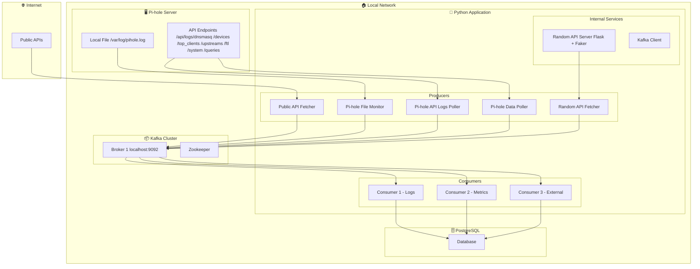

## 📝 **Atualização final do README**

# Kafka n APIs

[](https://www.python.org/)
[](https://kafka.apache.org/)

**Streaming Pi-hole DNS events, Public API data, and Localhost Random Data through Kafka**

`Kafka n APIs` ingests data from **five independent sources** into Apache Kafka topics, where **three independent consumers** process, correlate, and act on these event streams.

---

## Table of Contents

- [Overview](#overview)
- [Architecture](#architecture)
- [Project Structure](#project-structure)
- [Features](#features)
- [Tech Stack](#tech-stack)
- [Getting Started](#getting-started)
- [Configuration](#configuration)
- [Usage](#usage)
- [Roadmap](#roadmap)

---

## Overview

> "Kafka n APIs is a data pipeline that integrates multiple data sources into a single Kafka bus, allowing independent consumers to process information in real-time."

| Source | Description |
|--------|-------------|
| **Pi-hole (local)** | Tails `/var/log/pihole/pihole.log` |
| **Pi-hole (API logs)** | Polls `/api/logs/dnsmasq` |
| **Pi-hole (API)** | Fetches `/devices`, `/top_clients`, `/upstreams`, `/ftl`, `/system`, `/queries` |
| **Public APIs** | External data from multiple free test APIs |
| **Localhost Random API** | Synthetic data (people, companies, random text) via `Faker` + Flask |

From there, **three independent consumers** subscribe to these topics and process the data:

1. **Consumer 1** – processes DNS logs (local + API)
2. **Consumer 2** – processes metrics and system data
3. **Consumer 3** – processes external and synthetic data

---

## Architecture



**Legend:**

| Color | Component | Description |
|-------|-----------|-------------|
| 🔵 Light Blue | 🌐 Internet | External public APIs (HTTP access) |
| 🟣 Light Purple | 🏠 Local Network | Internal local network environment |
| 🟡 Light Orange | 🖥️ Pi-hole Server | Pi-hole server with local logs and API |
| 🟢 Light Green | 🐍 Python Application | Python code with producers, consumers, and services |
| 🟡 Light Yellow | 📦 Kafka Cluster | Kafka cluster for event streaming |
| 🟢 Teal | 🗄️ PostgreSQL | Database for persistence |


---

## 📁 **Project Structure**


### 🗂️ Directory Tree

```
kafka-n-apis/
├── docker-compose.yml                    # Kafka + Zookeeper
├── .env.example                          # Environment template
├── requirements.txt                      # Python dependencies
├── README.md                             # Project documentation
├── .gitignore                            # Files ignored by Git
├── Makefile                              # Useful commands (optional)
│
├── src/                                  # Main source code
│   ├── __init__.py
│   │
│   ├── producers/                        # Producers (send data to Kafka)
│   │   ├── __init__.py
│   │   ├── base_producer.py              # Base class for producers
│   │   ├── pi_hole_file_monitor.py       # Tailing pihole.log → Kafka
│   │   ├── pi_hole_api_logs_poller.py    # Fetching /api/logs/dnsmasq → Kafka
│   │   ├── pi_hole_data_poller.py        # Fetching /devices, /top_clients, /upstreams, etc.
│   │   ├── public_api_fetcher.py         # Public APIs → Kafka
│   │   └── random_api_fetcher.py         # Localhost random API → Kafka
│   │
│   ├── consumers/                        # Consumers (process data from Kafka)
│   │   ├── __init__.py
│   │   ├── base_consumer.py              # Base class for consumers
│   │   ├── consumer_1_logs.py            # Processes DNS logs (file + API)
│   │   ├── consumer_2_metrics.py         # Processes metrics (devices, clients, upstreams, etc.)
│   │   └── consumer_3_external.py        # Processes external data (public APIs + random)
│   │
│   ├── services/                         # Auxiliary services
│   │   ├── __init__.py
│   │   ├── api_client.py                 # HTTP client for external APIs
│   │   ├── random_api_server.py          # Flask server for random data
│   │   └── kafka_client.py               # Kafka client (producer/consumer)
│   │
│   ├── models/                           # Data models (schemas)
│   │   ├── __init__.py
│   │   ├── pi_hole_log.py                # Schema for Pi-hole logs
│   │   ├── pi_hole_metric.py             # Schema for Pi-hole metrics
│   │   ├── public_api_data.py            # Schema for public API data
│   │   └── random_data.py                # Schema for random data
│   │
│   ├── config/                           # Configuration
│   │   ├── __init__.py
│   │   ├── settings.py                   # Loads .env variables
│   │   └── topics.py                     # Kafka topic definitions
│   │
│   ├── utils/                            # Utilities
│   │   ├── __init__.py
│   │   ├── logger.py                     # Logging configuration
│   │   ├── file_watcher.py               # File monitoring (tail -f)
│   │   └── timestamp.py                  # Timestamp manipulation
│   │
│   └── __main__.py                       # Entry point (optional)
│
├── tests/                                # Tests
│   ├── __init__.py
│   ├── test_producers.py                 # Producer tests
│   ├── test_consumers.py                 # Consumer tests
│   └── conftest.py                       # Test configuration
│
├── scripts/                              # Support scripts
│   ├── create_topics.sh                  # Creates Kafka topics
│   ├── delete_topics.sh                  # Removes Kafka topics
│   └── start_producers.sh                # Starts all producers
│
├── data/                                 # Local data (optional)
│   └── logs/                             # Project-generated logs
│
└── mermaid-diagrams/                     # Project Mermaid diagrams
```


---

## 📄 **Main Files Breakdown**

### **Producers (src/producers/)**

| File | Description |
|------|-------------|
| `base_producer.py` | Abstract class with common methods (Kafka connection, message sending, error handling) |
| `pi_hole_file_monitor.py` | Monitors `/var/log/pihole/pihole.log` using `file_watcher.py` and sends lines to topic `pi-hole.logs.file` |
| `pi_hole_api_logs_poller.py` | Polls the `/api/logs/dnsmasq` endpoint every N seconds and sends to `pi-hole.logs.api` |
| `pi_hole_data_poller.py` | Queries endpoints `/devices`, `/top_clients`, `/upstreams`, `/ftl`, `/system`, `/queries` and sends to `pi-hole.data.endpoints` |
| `public_api_fetcher.py` | Makes requests to public APIs (ip-api, viacep, etc.) and sends to `public.api.data` |
| `random_api_fetcher.py` | Queries `http://localhost:5000/random` and sends to `random.data.raw` |

### **Consumers (src/consumers/)**

| File | Description |
|------|-------------|
| `base_consumer.py` | Abstract class with common methods (Kafka connection, message consumption, processing) |
| `consumer_1_logs.py` | Subscribes to topics `pi-hole.logs.file` and `pi-hole.logs.api` and processes DNS logs |
| `consumer_2_metrics.py` | Subscribes to topic `pi-hole.data.endpoints` and processes metrics (devices, top clients, upstreams, FTL, system, queries) |
| `consumer_3_external.py` | Subscribes to topics `public.api.data` and `random.data.raw` and processes external data |

### **Services (src/services/)**

| File | Description |
|------|-------------|
| `api_client.py` | Reusable HTTP client for calling external APIs (error handling, retry, timeouts) |
| `random_api_server.py` | Flask server that generates random data at `/random` |
| `kafka_client.py` | Encapsulates Kafka connection (production and consumption) |

### **Models (src/models/)**

| File | Description |
|------|-------------|
| `pi_hole_log.py` | Schema for Pi-hole logs (timestamp, client, domain, status) |
| `pi_hole_metric.py` | Schema for metrics (devices, top clients, upstreams, etc.) |
| `public_api_data.py` | Schema for public API data (geolocation, etc.) |
| `random_data.py` | Schema for random data (id, value, category, timestamp) |

### **Configuration (src/config/)**

| File | Description |
|------|-------------|
| `settings.py` | Loads `.env` variables using `python-dotenv` |
| `topics.py` | Defines constants with topic names |

### **Utilities (src/utils/)**

| File | Description |
|------|-------------|
| `logger.py` | Configures logging with levels, colors, and format |
| `file_watcher.py` | Monitors files in real-time (tail -f) |
| `timestamp.py` | Functions for timestamp manipulation (formatting, conversion) |

### **Scripts (scripts/)**

| File | Description |
|------|-------------|
| `create_topics.sh` | Creates Kafka topics: `pi-hole.logs.file`, `pi-hole.logs.api`, `pi-hole.data.endpoints`, `public.api.data`, `random.data.raw` |
| `delete_topics.sh` | Removes topics (useful for cleanup) |
| `start_producers.sh` | Starts all producers in the background |

---


## ✨ Features

| Category | Feature |
|----------|---------|
| **Pi-hole Integration** | ✅ DNS logs via local file (real-time) |
|  | ✅ DNS logs via API (remote access) |
|  | ✅ Metrics: devices, top clients, upstreams, FTL, system, queries |
| **External APIs** | ✅ Multiple public APIs fetched as Kafka events |
| **Synthetic Data** | ✅ Localhost random data generator with `Faker` |
| **Consumers** | ✅ **3 independent consumers** for parallel processing |
|              | ✅ Logs, Metrics, and External data separation |
| **Kafka** | ✅ Configurable topics, consumer groups, and partitioning |
| **Deployment** | ✅ Designed for local development with Docker Compose |
| **Future Ready** | ✅ Extensible architecture for new data sources |

---

## 🛠️ Tech Stack

| Layer          | Technology |
|----------------|------------|
| **Messaging**  | [Apache Kafka](https://kafka.apache.org/) |
| **Producers**  | [Python](https://www.python.org/) + [`kafka-python`](https://kafka-python.readthedocs.io/) |
| **Consumers**  | Python microservices |
| **HTTP**       | [`requests`](https://docs.python-requests.org/) |
| **APIs**       | [Pi-hole](https://pi-hole.net/), [ip-api.com](https://ip-api.com/), [viacep.com.br](https://viacep.com.br/), Localhost Random API |
| **Data**       | [`pandas`](https://pandas.pydata.org/) |
| **Database**   | [PostgreSQL](https://www.postgresql.org/) + [`psycopg2-binary`](https://www.psycopg.org/) |
| **Config**     | [`python-dotenv`](https://github.com/theskumar/python-dotenv) |
| **Containers** | [Docker](https://www.docker.com/) + [Docker Compose](https://docs.docker.com/compose/) |
| **Dev tools**  | [`venv`](https://docs.python.org/3/library/venv.html), [`Flask`](https://flask.palletsprojects.com/) (for localhost API) |

---

## 🚀 Getting Started

### Prerequisites

- Python 3.10+
- Docker & Docker Compose
- Pi-hole instance accessible on your network

### 1. Clone the repository

```bash
git clone https://github.com/SEU_USUARIO/kafka-n-apis.git
cd kafka-n-apis
```

### 2. Start Kafka and Zookeeper

```bash
docker-compose up -d
```

> Uses `bitnami/kafka` and `bitnami/zookeeper`. Brokers available at `localhost:9092`.

**Verify Kafka is running:**

```bash
docker ps | grep kafka
```

**Expected output:**
```
<container_id>   bitnami/kafka:latest   "/opt/bitnami/script…"   Up  0.0.0.0:9092->9092/tcp
```

### 3. Install Python dependencies

```bash
pip install -r requirements.txt
```

### 4. Configure environment

```bash
cp .env.example .env
```

Edit `.env` with your Pi-hole URL, API tokens, and Kafka bootstrap.

### 5. Run the localhost random API (separate terminal)

```bash
python -m src.services.random_api_server
```

> Runs a Flask server at `http://localhost:5000/random` powered by `Faker`.

### 6. Run the consumers (three separate terminals)

**Consumer 1 (DNS logs):**
```bash
python -m src.consumers.consumer_1_logs
```

**Consumer 2 (Metrics and system data):**
```bash
python -m src.consumers.consumer_2_metrics
```

**Consumer 3 (External and synthetic data):**
```bash
python -m src.consumers.consumer_3_external
```

### 7. Verify consumers are running (optional)

```bash
ps aux | grep consumer
```

---

## 🖥️ Usage

### Quick test with Kafka Console (produce & consume)

**First, enter the Kafka container:**

```bash
docker exec -it kafka bash
```

**Produce a test message:**

```bash
echo "test" | kafka-console-producer --broker-list localhost:9092 --topic test
```

**Consume the test message:**

```bash
kafka-console-consumer --bootstrap-server localhost:9092 --topic test --from-beginning --max-messages 1
```

**Exit the container:**

```bash
exit
```

### List all Kafka topics

```bash
docker exec -it kafka kafka-topics.sh --list --bootstrap-server localhost:9092
```

### List consumer groups

```bash
docker exec -it kafka kafka-consumer-groups.sh --bootstrap-server localhost:9092 --list
```

### Top 3 from Pi-hole topic

```bash
docker exec -it kafka kafka-console-consumer.sh --bootstrap-server localhost:9092 --topic pi-hole.logs.file --from-beginning --max-messages 3
```

### Running consumers (if not already running)

**Consumer 1 (DNS logs):**
```bash
python -m src.consumers.consumer_1_logs
```

**Consumer 2 (Metrics and system data):**
```bash
python -m src.consumers.consumer_2_metrics
```

**Consumer 3 (External and synthetic data):**
```bash
python -m src.consumers.consumer_3_external
```

---

## Configuration

| Variable              | Description                     | Default           |
|-----------------------|---------------------------------|-------------------|
| `KAFKA_BOOTSTRAP`     | Kafka bootstrap server          | `localhost:9092`  |
| `PIHOLE_URL`          | Pi-hole admin API URL           | —                 |
| `PIHOLE_API_TOKEN`    | Pi-hole API token               | —                 |
| `PIHOLE_LOG_PATH`     | Path to local pihole.log        | `/var/log/pihole/pihole.log` |
| `RANDOM_API_URL`      | Localhost random API URL        | `http://localhost:5000/random` |


---

## Roadmap

- [ ] WebSocket API for real-time dashboards
- [ ] Dead-letter queue for failed events
- [ ] Schema Registry and Avro support
- [ ] Metrics export (Prometheus)
- [ ] Kubernetes manifests

---

## 👋 See You Around

Thanks for stopping by. I hope this project gave you a little spark.

Questions? Ideas? Want to share something cool?  
Just open an issue or say hello.

**Go build something awesome.** 🚀

---